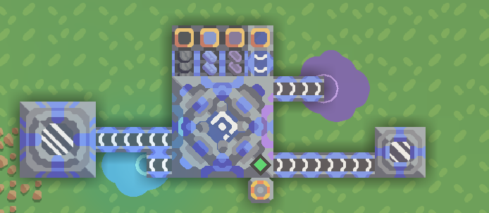
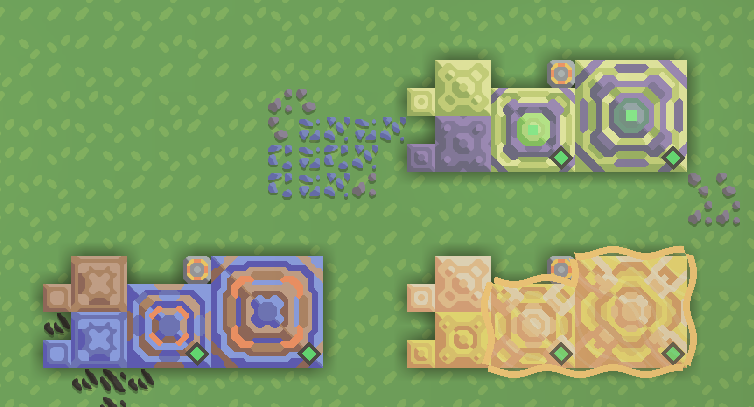
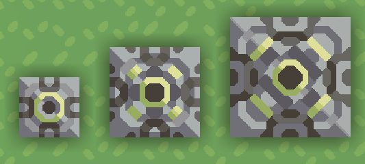

# Upgraded Content
## Mindustry mod that adds in 1 or 2 tiers of existing vanilla blocks, some may have more different uses.

# v2.0 Official Update:
- This update brought in some extra stuffs for Serpulo campaign. Erekir contents are being worked:
+ Liquid: Antifreeze - Tier 2 coolant. Used for turrets and certain power reactors. 

+ Defense: Combined walls - Direct upgrades to 2 specific types of vanilla walls. Has 3 tier with different special uses for each tier.

+ Power: Oil Combustion Generator - Use oil as the only input to produce power, however slightly less effective than vanilla coal combustion.

## Current content
- Tier 2-3 blocks for Serpulo's contents.

# Todo list:
- Erekir contents
- Serpulo turrets category

## Contributors:
- theworldzen: Russian translation
- thebildeo: Korean translation (outdated)

# Note to self about content sorting:
1a - Crafting
2a - Defense
3a - Effect
4a - Distribution
5a - Liquid
6a - Power
7a - Drill / Production
